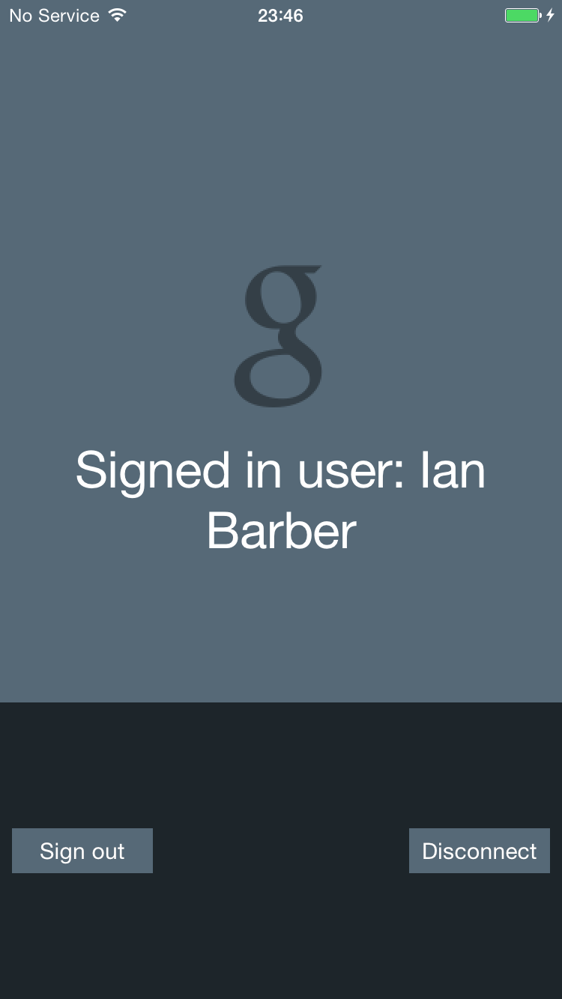

Google Sign-In Quickstart with Backend Server Authentication
==============================================================

This code is based on the Quickstart example provided by Google. I've modified the example to include backend server authentication. Please note that I am fairly new to Android development. This example may not be the best way to do things, but it does work.

Sign-In
-------
Follow the instructions here to get sign-in working.
https://github.com/googlesamples/google-services/tree/master/android/signin

Backend Server Authentication
-----------------------------
This is based on documentation here:
https://developers.google.com/identity/sign-in/android/backend-auth

More detailed related instructions are here:
http://android-developers.blogspot.com/2013/01/verifying-back-end-calls-from-android.html

To get this example working make sure you've created and downloaded google-services.json and placed it in your app directory.

Your project in Google Developer Console should have both an Android client Oauth2 ID and a Web client Oauth2 ID. The package name in the Android Manifest should match the name in the Android client package name. For this project it is com.google.samples.quickstart.signin

Use the Web client id as 

When you run the example, if everything works right you should see the id token logged to the console in Android Studio. It will say something like:

com.google.samples.quickstart.signin D/GetTokenTask﹕ token is: xxxxxxx

Screenshots
-----------

